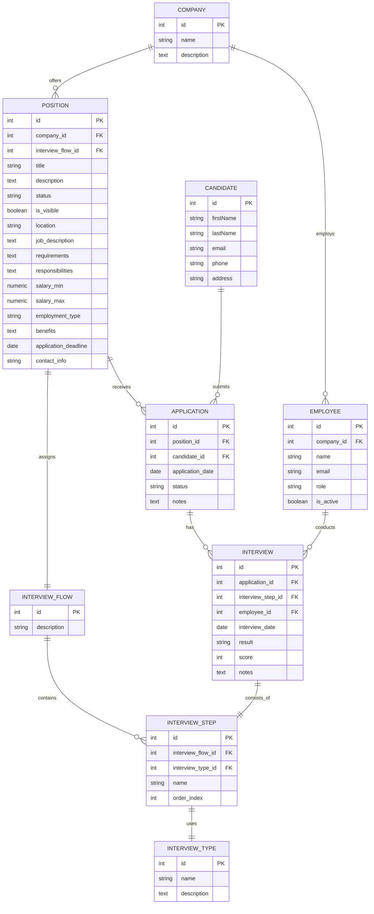

# Prompts FFA — Conversación completa

**Proyecto:** AI4Devs-db-2604  
**Tema:** ERD → SQL → Normalización → Plan de migración → Implementación por fases  
**Fecha:** 2026-06-20  
**Archivos clave generados:**
- `backend/prisma/ERD`
- `backend/prisma/schema_from_erd.sql`
- `backend/prisma/migration-scripts/` (000–007, verify_001–006, README)
- `backend/prisma/schema.prisma` (actualizado Fase 6)
- `backend/prisma/migration-scripts/baseline_snapshot.md`

---

## Turno 1

### Usuario

> Tomando el rol de ARQUITECTO DE BASES DE DATOS quiero que me transforme @backend/prisma/ERD que se encuentra en formato mermaid a un script de SQL

### Asistente

Transformé el ERD Mermaid en un script DDL de PostgreSQL en `backend/prisma/schema_from_erd.sql`.

**Mapeo ERD → SQL:**

| Entidad ERD | Tabla SQL | Notas |
|---|---|---|
| `COMPANY` | `company` | PK con `IDENTITY` |
| `EMPLOYEE` | `employee` | FK → `company` |
| `INTERVIEW_FLOW` | `interview_flow` | Tabla independiente |
| `INTERVIEW_TYPE` | `interview_type` | Tabla independiente |
| `INTERVIEW_STEP` | `interview_step` | FK → `interview_flow`, `interview_type` |
| `POSITION` | `position` | FK → `company`, `interview_flow` |
| `CANDIDATE` | `candidate` | `firstName`/`lastName` → `first_name`/`last_name` |
| `APPLICATION` | `application` | FK → `position`, `candidate` |
| `INTERVIEW` | `interview` | FK → `application`, `interview_step`, `employee` |

**Decisiones de diseño:**
1. PostgreSQL (coherente con `schema.prisma`)
2. Convención snake_case en tablas y columnas
3. Relaciones del ERD con FKs, UNIQUE para 1:1, CHECKs de integridad
4. Índices en FKs y campos de consulta frecuente
5. Script envuelto en `BEGIN` / `COMMIT`

---

## Turno 2

### Usuario

> Ahora quiero que revises si al aplicar este script SQL @backend/prisma/schema_from_erd.sql sobre la base de datos se cumpliran los niveles de normalizacion de bases de datos (1FN ,2FN ,3FN, FNBC) y la definicion de indices

### Asistente

**Resumen ejecutivo:**

| Nivel | Cumplimiento | Veredicto |
|-------|--------------|-----------|
| **1FN** | Casi total | Cumple, con reserva en `benefits` |
| **2FN** | Total | Cumple |
| **3FN** | Parcial | Violación: `position.company_description` |
| **FNBC** | Parcial | Falta UNIQUE en `interview_type.name`, email empleado |
| **Índices** | Aceptable | Correctos en esencia; huecos y algunos discutibles |

**Violación 3FN identificada:** `company_description` en `position` depende transitivamente de `company` → debe moverse a `company.description`.

**Índices recomendados a añadir:**
- `idx_interview_interview_step_id`
- `idx_application_position_status`
- `idx_employee_company_active` (parcial)

**Índices discutibles (baja selectividad):** `idx_employee_is_active`, `idx_position_is_visible`, `idx_interview_result`.

---

## Turno 3

### Usuario

> Aplica las correcciones necesarias para cumplir con estos requisitos sin perder la estructura del @backend/prisma/ERD

### Asistente

Correcciones aplicadas en `schema_from_erd.sql` y alineadas en `ERD`.

**Cambios de normalización:**

| Problema | Corrección |
|----------|------------|
| 3FN/FNBC — `company_description` en `position` | Movido a `company.description` |
| FNBC — `interview_type.name` | `UNIQUE (name)` |
| FNBC — email empleado | `UNIQUE (company_id, email)` |
| ERD 1:1 — `INTERVIEW_STEP ↔ INTERVIEW_TYPE` | `UNIQUE (interview_type_id)` |
| Email candidato | `UNIQUE (email)` como constraint |

**ERD actualizado:** `COMPANY` incluye `description`; eliminado `company_description` de `POSITION`.

**Estado final:** 1FN, 2FN, 3FN y FNBC cumplidos.

---

## Turno 4

### Usuario

> Ahora en base a ese script genera un plan de accion para asegurar la implementacion paso a paso sin perder datos

### Asistente

Plan incremental en 8 fases:

- **Fase 0:** Baseline, backup, auditoría emails duplicados
- **Fase 1:** Catálogos (`company`, `interview_flow`, `interview_type`)
- **Fase 2:** Migración `Candidate` → `candidate`
- **Fase 3:** `company_description` legacy (si aplica)
- **Fase 4:** Constraints FNBC
- **Fase 5:** Índices
- **Fase 6:** Prisma + aplicación
- **Fase 7:** Validación integral
- **Fase 8:** Rollback

**Contexto crítico:** convivencia con tablas Prisma existentes (`Education`, `WorkExperience`, `Resume`).

**Nota:** El plan original tenía un error de orden (crear `application` antes de `candidate`).

---

## Turno 5

### Usuario

> Ahora quiero que revises si sigue cumpliendo el @backend/prisma/ERD

### Asistente

**Veredicto:** El plan cumple la estructura conceptual del ERD, pero con **un error de orden en Fase 1** y **matiz en cardinalidad `INTERVIEW ↔ INTERVIEW_STEP`**.

**Problema crítico:** `application` e `interview` no pueden crearse antes de `candidate`.

**Orden corregido propuesto:**

```
Fase 1: company, interview_flow, interview_type
Fase 2: candidate
Fase 3: employee, interview_step, position
Fase 4: application, interview
Fase 5: constraints + índices
Fase 6: Prisma + app
Fase 7: validación
```

**Fase 3 legacy (`company_description`):** omitir en BD nueva; solo si hay BD anterior.

---

## Turno 6

### Usuario

> Reescrie el plan con el orden corregido

### Asistente

Plan reescrito con orden corregido por dependencias FK:

| Fase | Script / Acción | Tablas |
|------|-----------------|--------|
| 0 | `000_baseline.sql` | Inventario |
| 1 | `001_catalogos_base.sql` | company, interview_flow, interview_type |
| 2 | `002_migrate_candidate.sql` | candidate |
| 3 | `003_operacion.sql` | employee, interview_step, position |
| 4 | `004_transaccional.sql` | application, interview |
| 5 | `005_indexes.sql` | 12 índices |
| 6 | Prisma + código | schema.prisma, API |
| 7 | `006_validacion_erd.sql` | Validación |
| 8 | `007_legacy_…sql` | Condicional |

Entregables: `001`–`005`, `validacion_erd.sql`, README.

---

## Turno 7

### Usuario

> Si genera los archivos numerados y despues comenzaremos con las migracion paso a paso con mi aprovacian previa en cada fase y tienes que comprobar que los cambios se han realizado correctamente segun el plan sin perder le objetivo principal del @backend/prisma/ERD

### Asistente

Scripts generados en `backend/prisma/migration-scripts/`:

| Archivo | Fase |
|---------|------|
| `000_baseline.sql` | 0 |
| `001_catalogos_base.sql` | 1 |
| `002_migrate_candidate.sql` | 2 |
| `003_operacion.sql` | 3 |
| `004_transaccional.sql` | 4 |
| `005_indexes.sql` | 5 |
| `006_validacion_erd.sql` | 7 |
| `007_legacy_company_description.sql` | 8 (condicional) |
| `verify_001.sql` … `verify_006.sql` | Verificación |
| `README.md` | Guía |

Proceso acordado: ejecutar → verificar → mostrar resultados → esperar aprobación.

**Pendiente:** Fase 0 con aprobación del usuario.

---

## Turno 8

### Usuario

> Ejecuta fase 0

### Asistente

**Fase 0 completada** contra PostgreSQL 18.4 en Docker (`ai4devs-db-2604-db-1`).

**Resultados:**

| Check | Resultado |
|-------|-----------|
| Tablas en `public` | **0** |
| Legacy Prisma | No existen |
| Emails duplicados | N/A |
| Tablas ERD pendientes | **9/9** |

**Escenario:** BD greenfield (vacía). Sin riesgo de pérdida de datos.

**Ajuste:** `000_baseline.sql` actualizado para soportar BD vacía (consultas dinámicas con `EXECUTE`).

Snapshot guardado en `baseline_snapshot.md`.

---

## Turno 9

### Usuario

> Aprobado Fase 1

### Asistente

**Fase 1 completada.**

```
BEGIN → CREATE TABLE company, interview_flow, interview_type → COMMIT
```

| Criterio | Resultado |
|----------|-----------|
| 3 tablas catálogo | OK |
| Columnas ERD | OK |
| Legacy intacto | OK (greenfield) |

**Tablas en BD:** 3 (`company`, `interview_flow`, `interview_type`).

---

## Turno 10

### Usuario

> Aprobado Fase 2

### Asistente

**Fase 2 completada.**

Escenario B (greenfield): `CREATE TABLE candidate` vacía.

| Criterio | Resultado |
|----------|-----------|
| `candidate` existe | OK |
| Columnas `first_name`, `last_name`, `email`… | OK |
| `uq_candidate_email` | OK |
| Registros | 0 |

**Tablas en BD:** 4.

---

## Turno 11

### Usuario

> Aprobado Fase 3

### Asistente

**Fase 3 completada.**

Tablas: `employee`, `interview_step`, `position`.

| Criterio | Resultado |
|----------|-----------|
| FKs hacia catálogos | OK |
| 1:1 `position↔flow`, `step↔type` | OK |
| Violaciones 1:1 | 0 filas |

**Tablas en BD:** 7.

---

## Turno 12

### Usuario

> Aprobado Fase 4

### Asistente

**Fase 4 completada.**

Tablas: `application`, `interview`.

| Criterio | Resultado |
|----------|-----------|
| **9/9 entidades ERD** | OK |
| FKs transaccionales | OK |
| Huérfanos | 0 |

**ERD completo (9/9).**

---

## Turno 13

### Usuario

> Aprobado Fase 5

### Asistente

**Fase 5 completada.**

**12 índices creados** sin errores.

| Fase | Estado |
|------|--------|
| 0–5 | OK |
| ERD 9/9 | OK |

Próximo paso: Fase 6 (Prisma) o Fase 7 (validación).

---

## Turno 14

### Usuario

> Aprobado Fase 6

### Asistente

**Fase 6 completada.**

**Cambios realizados:**

| Componente | Acción |
|------------|--------|
| `schema.prisma` | 12 modelos (9 ERD + 3 satélites) con `@map`/`@@map` |
| `backend/.env` | `DATABASE_URL` expandida |
| `docker-compose.yml` | Volumen `postgres_data` |
| `Candidate.ts` | `uploadDate` en nested create |
| `api-spec.yaml` | Descripción alineada al ERD |

**Verificación:**
- `prisma db push` — OK
- `prisma validate` — OK
- Tests Jest — **37/37 OK**

**Tablas finales (12):** 9 ERD + `education`, `work_experience`, `resume`.

**Incidente:** Al reiniciar Docker para exponer puerto 5432, se perdió el esquema (sin volumen). Se reaplicaron scripts 001–005 y se añadió volumen persistente.

---

## Turno 15

### Usuario

> aprobado fase 7

### Asistente

**Fase 7 completada — validación final.**

| Check | Resultado |
|-------|-----------|
| Entidades ERD 9/9 | OK |
| Columnas clave | 35 verificadas |
| Huérfanos FK | 0 |
| Violaciones cardinalidad | 0 |
| Constraints | 21 activos |
| Resumen ERD | **COMPLETO (9/9)** |

**Corrección en Fase 7:** `prisma db push` había dejado 1/12 índices. Reejecutado `005_indexes.sql` → **12/12 restaurados**.

---

## Turno 16

### Usuario

> Quiero que redactes en un una carpeta prompts un archivo , promts-ffa.md con esta conversacion entera, tanto los prompts como las respuestas

### Asistente

*(Este documento)*

---

## Anexo A — ERD final (Mermaid)



---

## Anexo B — Estado final de la migración

| Fase | Estado |
|------|--------|
| 0 — Baseline | OK |
| 1 — Catálogos | OK |
| 2 — Candidate | OK |
| 3 — Operación | OK |
| 4 — Transaccional | OK |
| 5 — Índices | OK |
| 6 — Prisma + app | OK |
| 7 — Validación | OK |

**Objetivo ERD:** cumplido.  
**Tests:** 37/37 OK.  
**Recomendación:** Tras futuros `prisma db push`, reejecutar `005_indexes.sql` si los índices personalizados desaparecen.

---

## Anexo C — Comandos útiles de ejecución

```powershell
# Cargar variables de entorno
cd c:\AI4DEVS\AI4Devs-db-2604
Get-Content .env | ForEach-Object {
  if ($_ -match '^([^=#]+)=(.*)$') {
    Set-Item -Path "env:$($matches[1].Trim())" -Value $matches[2].Trim('"')
  }
}

# Ejecutar fase N
Get-Content backend/prisma/migration-scripts/00N_*.sql |
  docker exec -i ai4devs-db-2604-db-1 psql -U $env:DB_USER -d $env:DB_NAME

# Prisma (desde backend/)
cd backend
npx prisma db push
npx prisma generate
npm test
```

---

*Documento generado automáticamente a partir de la conversación en Cursor.*
